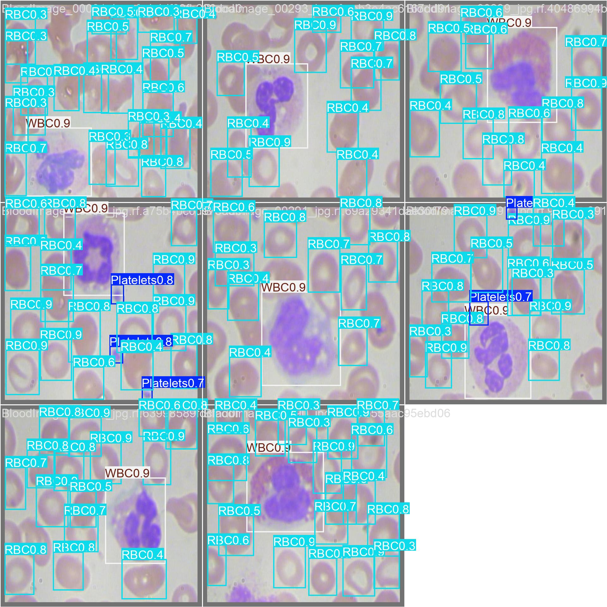
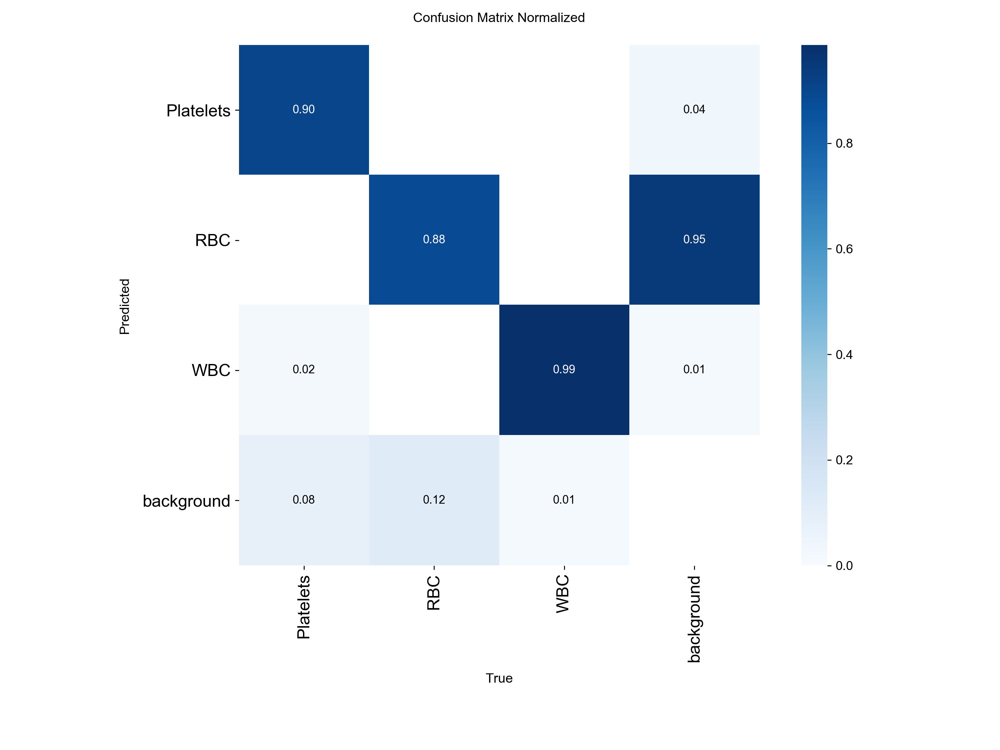
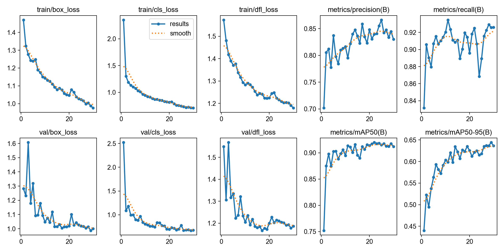
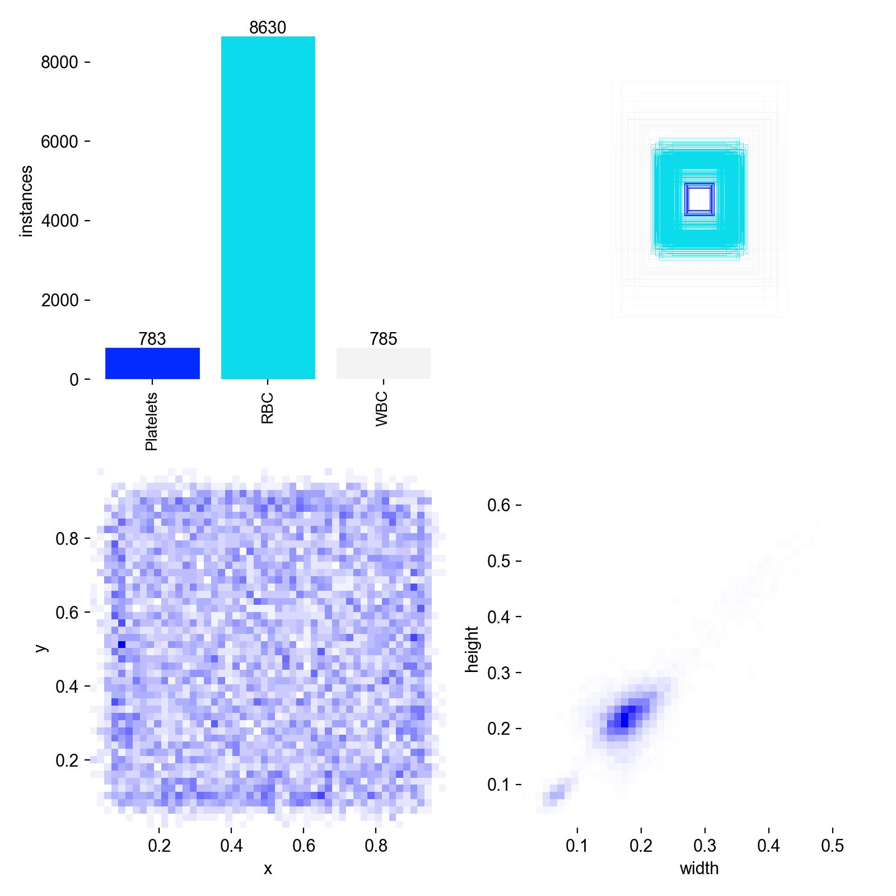

# yolo-object-detector

I'm training a YOLO model (v11) on a WBC AND RBC dataset I picked up on 
Roboflow. This not only is a README file but also my roadmap which will 
have many progressions and changes. I'm gonna be training first but before 
I begin i'm just gonna explain why i made certain decisions and what i've 
understood so far.

## Why YOLO11 specifically??

Medical imaging requires the localisation of the objects to be really 
precise, and since the blood (my dataset) cells could overlap with other 
cells since they're in huge numbers, an anchor based model isn't really 
efficient for our specific use-case (it may not match the shapes of the cells)

YOLOv11 works really well because it doesn't rely on almost "template" like 
bounding box shapes like its predecessors. Unlike two stage detectors, YOLO 
passes an image to the neural net and both classifies and localises 
simultaneously. It predicts the confidence scores, coords of the objects 
detected, and even class probabilities in a single forward pass.

Two stage detectors used to rely on region proposal and then classifying it 
but the process of cropping thousands of "potential" areas where an object 
could be and then passing it to the neural network is really slow. So 
YOLOv11 is a better architecture for this specific use case.

## What I understood from the performance and insights

I chose to train the model for 30 epochs, and I just used my mac instead 
of running it on the cloud, it took around 30 minutes to finish the training.

While I haven't completely understood the performance in a mathematical way, 
i'll still write about it (why not :D)

The dataset I chose is heavily skewed, it has over 8000 Red blood cells, 
and only around 800 white blood cells and platelets, despite this, the model 
has learned to identify all three classes accurately.

I began training and I trained it on 30 epochs, the device I used was an 
M2 Mac where I used MPS instead of cuda.

These are the final results, and do note that it'll take a while for me to 
actually internalize the theory when it comes to performance metrics :D

| Metric | Score | What it means |
|--------|-------|---------------|
| mAP50 | 0.917 | The model correctly detected and located our blood cells 91.7% of the time |
| Precision | 0.845 | Out of every box the model drew, 84.5% were actually correct |
| Recall | 0.926 | Our model found 92.6% real blood cells out of all the images |

**Dataset:**

| Class | Instances |
|-------|-----------|
| RBC | 8,630 |
| WBC | ~785 |
| Platelets | ~783 |

- Train: 761 images
- Valid: 74 images  
- Test: 32 images

## Findings & Limitations

There's a data imbalance, more RBCs and less WBCs and Platelets. 8000 
RBCs and around 785 WBC and Platelets.

I used the confidence filter on my second time testing the model on a random 
image and it kinda didn't draw as many boxes because the conf threshold was 
more than 50%.

Another variation i noticed was how the environment kept changing — on the 
random images, the colors and backgrounds were different, while the dataset 
had a consistent theme.

I could try to feed more data for the less numbered classes but I've already 
got 91% mAP. Data augmentation could also help. The model is more biased 
towards the higher numbered classes.

## Visualizations

